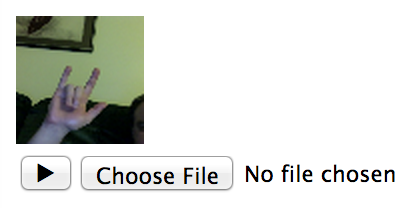

# get-user-media-input

Include JS

    
    

Apply `class="get-user-media"` and `data-zoom-root-id="profile-photo"` to each desired file upload field

    
    <form action="profile-photo">
      <input type="file" name="profile-photo" class="get-user-media" data-zoom-root-id="profile-photo"/>
    </form>

When the user clicks the play button, the `` will be replaced with a live video stream, clicking the video will submit the form with the new picture.

